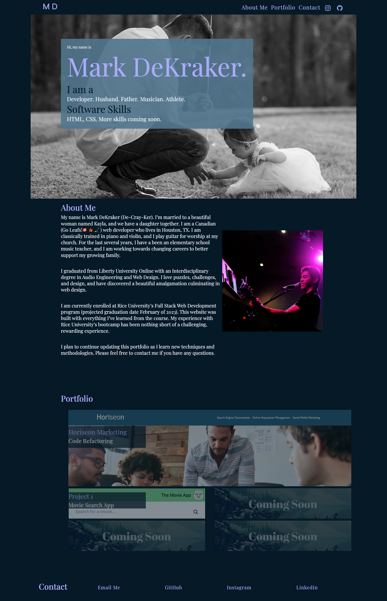
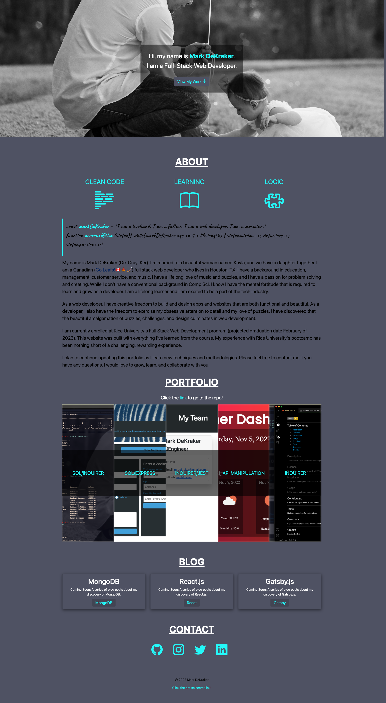

# Mark DeKraker Portfolio

<!-- HTML SHILED-->

---

## Table of Contents

- [About Me](#About-Me)
- [Usage](#usage)
- [Instructions](#instructions)
- [License](#license)
- [Questions](#questions)

---

## About Me

Hello! My name is Mark DeKraker. I am a MERN Full Stack Developer from Houston, TX. Please view my portfolio to see some of my work.

I will be graduating with a certificate in Full Stack Development Bootcamp from Rice University in January 2023. I currently have a 4.0 average in the class, and I am looking for a position as a Front End or Full Stack Developer.

I have experience with HTML, CSS, JavaScript, jQuery, Bootstrap, Node.js, Express.js, MySQL, and more.

In the very near future will also be MongoDB and React.js.

Please feel free to contact me with any questions.

---

## Questions

If you have any questions, please contact me at:

- GitHub: [mrdekraker](https://github.com/mrdekraker)
- Email: [mrdekraker@gmail.com](mailto:mrdekraker@gmail.com)
- Twitter: [@DekrakerMark](https://twitter.com/DekrakerMark)

---

## Recent Changes

This project is a labor of love. I am constantly updating and improving it. Here are the most recent changes.

Version 1.0.0 was my first release. It looked like this:

At the time, I was very proud of it, considering I had only been coding for a few months. I have since learned a lot more about web development and have made some major improvements.

Version 2.0.0 is my current release, and a major overhaul. It looks like this.

As you can see, my page looks a lot tighter, there are some JS animations, and I have added a few more projects. I am very proud of this version, and I hope you enjoy it.

## NOTE:

This project is a work in progress. As such, the blog links do not currently point anywhere. I am constantly updating and improving it. My next big challenge is to reformat it with Reactjs, and blog about it along the way. If you have any suggestions, please let me know.

---

## Collaborators

I would love to work with you. I am always looking for new opportunities to learn and grow. Please contact me if you would like to collaborate on a project.
